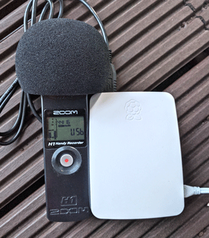

## EARS: Environmental Audio Recognition System

EARS is a proof of concept implementation of a convolutional neural network for live environmental audio processing & recognition on low-power SoC devices (in this case tested on a Raspberry Pi 3 Model B).

It features a background thread for audio capture & classification and a visual dashboard built as a [Bokeh](https://github.com/bokeh/bokeh/) server app for live visualization and audio streaming from the device to the browser.

**Caveats:**
This can become really taxing on the CPU, so some proper cooling solution (heatsink) is advisable. Nevertheless, it should do fine even without one when not using the Bokeh app too much.

## Quick look


## Installation

To recreate the environment used for developing this demo:

### Step 1 - prepare a Raspberry Pi device
- Get a spare Raspberry Pi 3 Model B with a blank SD card.
- Install a Raspbian Jessie Lite distribution (tested on version April 2017):
  - Download a Raspbian Jessie Lite image from [RaspberryPi.org](https://www.raspberrypi.org/downloads/raspbian/).
  - Use Etcher to flash the SD card (see [Raspberry Pi docs](https://www.raspberrypi.org/documentation/installation/installing-images/README.md) for details).
- Boot the device with the new card.
- Attach some input & display devices for configuration.
- Login using default credentials (`user: pi, password: raspberry`).
- Setup Wi-Fi access (see [Wi-Fi config on Raspberry Pi](https://www.raspberrypi.org/documentation/configuration/wireless/wireless-cli.md)).
- Use `sudo raspi-config` to enable SSH.
- Recreate SSH host keys:

```bash
sudo rm /etc/ssh/ssh_host_*
sudo dpkg-reconfigure openssh-server
```
  
### Step 2 - install Python 3.6 using [Berry Conda](https://github.com/jjhelmus/berryconda)

- Install conda for armv7l to `/opt/conda`:

```bash
wget http://repo.continuum.io/miniconda/Miniconda3-latest-Linux-armv7l.sh
chmod +x Miniconda3-latest-Linux-armv7l.sh
sudo ./Miniconda3-latest-Linux-armv7l.sh
```
 
- Add `export PATH="/opt/conda/bin:$PATH` to the end of `/home/pi/.bashrc`. Then reload with `source /home/pi/.bashrc`.

- Install Python with required packages:

```bash
conda config -add channels rpi
conda create -n ears python=3.6
source activate ears
conda install cython numpy pandas scikit-learn cffi h5py
sudo apt-get install libasound-dev libportaudio-dev portaudio19-dev libportaudio2
```

### Step 3 - download EARS and install requirements

- Download EARS source code and unpack it to `/home/pi/ears`. Then install the required packages by issuing:

```bash
pip install -r /home/pi/ears/requirements.txt
```

- Plug a Zoom H1 microphone (or some other audio device, that's the one I used for initial testing) in an audio interface mode (44.1 kHz/16 bit), and verify it's listed b `python -m sounddevice`.
- Update the `--allow-websocket-origin` option inside `/home/pi/ears/run.sh` file with the IP address of the Raspberry Pi device.
- Finally, run the app with:

```bash
chmod +x /home/pi/ears/run.sh
cd /home/pi/ears
./run.sh
```

- Open the web browser to: http://RASPBERRY_PI_IP:5006/

## Training new models

For the time being EARS comes preloaded with a very rudimentary model trained on the [ESC-50 dataset](https://github.com/karoldvl/ESC-50) (3-layer 3x3 convnet), so it's recognition capabilities are limited for live scenarios.

If you want to train the same model on a different dataset:
- Download the source code to a workstation/server with a GPU card.
- Put all audio files (WAV) into `ears/dataset/audio`.
- Replace the [`ears/dataset/dataset.csv`](ears/dataset/dataset.csv) file with new CSV:

```csv
filename,category
```

- Run `python train.py` - this should result in the following files being generated on the server:

File                | Description
------------------- | ------------------------------------------------------- 
`model.h5`          | weights of the learned model
`model.json`        | a serialized architecture of the model (Keras >=2.0.0)  
`model_labels.json` | dataset labels

- Upload the new model files to the Raspberry Pi device and restart the app.

If you want to train a completetly different model, then you can have a look at [`train.py`](ears/train.py), but in this case you probably already know what to do either way.

## Photos from my development field:

 

## License

MIT © Karol J. Piczak
